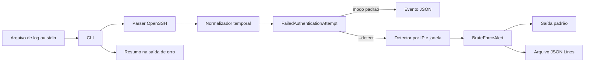

# Arquitetura do SSH Log Sentinel

## Visão geral

O fluxo é unidirecional. A interface coordena a leitura, mas as regras de
interpretação e detecção permanecem em componentes separados. Nenhum componente
executa bloqueio ou altera o sistema operacional.

## Componentes

| Componente | Responsabilidade | Não faz |
| --- | --- | --- |
| `cli.py` | Lê arquivo ou stdin, aplica opções e serializa resultados | Interpretar diretamente o texto do OpenSSH |
| `parser.py` | Reconhece `Failed password`, valida campos e normaliza horários | Classificar um IP como suspeito |
| `models.py` | Define eventos e alertas imutáveis | Executar regras ou produzir efeitos externos |
| `detector.py` | Agrupa falhas por IP, limiar e janela temporal | Ler arquivos, imprimir ou bloquear endereços |
| `tests/` | Verifica unidades, integração e volume sintético | Consumir dados reais ou pessoais |
| GitHub Actions | Repete testes e qualidade em versões suportadas | Publicar pacote ou alterar o repositório |

## Fluxo temporal

Timestamps ISO 8601 são convertidos diretamente para UTC. Registros syslog não
possuem ano nem fuso; por isso, essas informações entram pela CLI. O
`TimestampNormalizer` mantém o contexto entre linhas e interpreta uma regressão
superior a 180 dias como virada de ano.

O detector exige `occurred_at`. Para cada IP, ele mantém somente as tentativas
da janela vigente. Ao atingir o limiar, emite um alerta e evita repetições no
mesmo fluxo contínuo. Um intervalo maior que a janela rearma esse IP.

## Decisões de segurança

- entradas desconhecidas são ignoradas sem execução de seu conteúdo;
- IP e porta são validados antes da criação do evento;
- detecção com tempo insuficiente falha explicitamente;
- o arquivo de alertas só é escrito após a análise completa;
- o workflow do GitHub possui apenas permissão de leitura do conteúdo;
- endereços dos exemplos pertencem a faixas reservadas para documentação;
- bloqueio automático permanece fora do escopo.

